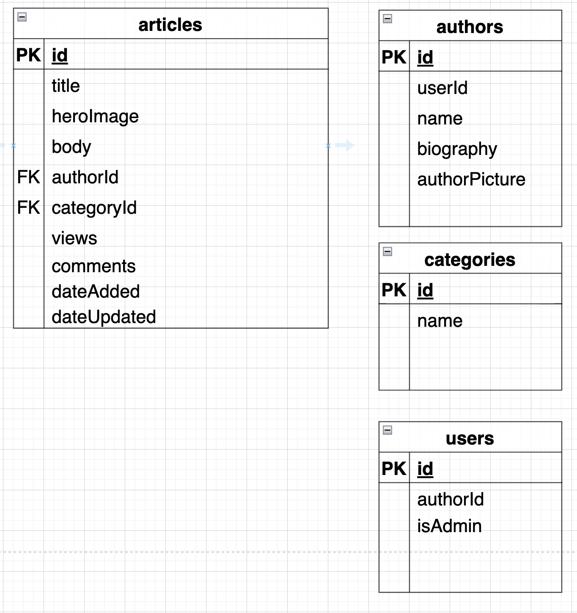

# Synthetica

The Ultimate Blog for all things Technology, Movies, Music, and Games

## Features
- Home Page Displays Top 3 Popular Articles by Views
- Lists 3 Latest Articles by Category
- Can go to each Categories page and view all articles within
- Can view the actual article itself with in page components
- Create your own post (currently auto logged in as mock user 1)
- When creating articles, the only markdown recognized is new line breaks

 
### Screenshot

## Getting Started

### Prerequisites

- Node.js (v17.5 or later)
- Git

### Installation

1. Open your favorite terminal and copy the following commands step by step:

2. Clone the repository:

`git clone git@github.com:JAW5RG3_thdgit/synthetica.git`

3. Change directory into the project folder:

`cd Synthetica`

4. Install the necessary dependencies:

`npm install`

### Running the server

To start the server, run the following commands:
`npm run start-server`

This will run a concurrently script to start the JSON server and make it available at http://localhost:3000, as well as
start the angular http server at http://localhost:4200

### Interacting with the server

Navigate to `http://localhost:4200` to interact with the application

You can also interact with the server using RESTful API calls
The JSON server will automatically serve data from the db.json file in the project directory.

- For example, to retrieve all the data from the server, use the following URL in your browser:

`http://localhost:3000/articles`

## Built With

- Angular
- Node.js
- json-server
- concurrently
- Angular Zorro Ant-D
- Angular Bootstrap CSS

## Project Resources

- [Trello Board](https://trello.com/invite/b/WIlRIKde/ATTI02428b8c0837c3f3c08155e241163c3f1D47C7E0/angular-blog-synthetica)

## Database Schema

